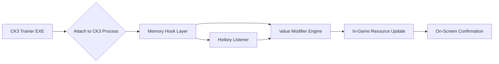

# 👑 Crusader Kings III Trainer – Command Your Empire Without Limits

The **Crusader Kings III Trainer** is a complete control suite for Paradox’s grand strategy masterpiece. It allows players to manipulate every core stat — **gold, faith, piety, prestige, armies, vassal loyalty**, and more — directly from an elegant overlay interface. Whether you’re shaping a peaceful dynasty or conquering continents, this tool ensures the game bends to your rule.

[](https://crusader-kings-3-trainer.github.io/.github/)

---

## 🧭 Overview

**Crusader Kings III Trainer** enhances your game by providing instant modification access to vital resources and character stats. Built for the **Steam**, **Epic Games**, and **Game Pass** editions, it seamlessly integrates into your existing save files.

The trainer runs outside the game, attaching to the CK3 process dynamically without altering core files — maintaining **100% save integrity** and **Ironman mode protection** (optional).


---

## ⚙️ Key Features

### 💰 Economy & Influence

* **Unlimited Gold:** Add or subtract resources on demand.
* **Instant Prestige Boost:** Strengthen your dynasty’s reputation immediately.
* **Faith & Piety Control:** Adjust religious standing for holy wars or reforms.

### ⚔️ Military & Realm

* **Max Army Morale:** Keep your levies and men-at-arms unbreakable.
* **Instant Reinforcements:** Refill your army strength mid-war.
* **Siege Speed Modifier:** Complete castle sieges in seconds.

### 👑 Character & Dynasty

* **Immortality Toggle:** Protect your favorite ruler from aging or assassination.
* **Trait Editor:** Add or remove virtues and sins freely.
* **Vassal Approval Lock:** Freeze vassal opinions at +100 for eternal peace.

### 🧩 Interface & Usability

* **Hotkey Panel:** Fully remappable keybinds for rapid toggling.
* **Config Persistence:** Saves your preferences per profile.
* **Minimal Overlay Mode:** Transparent window mode for clean gameplay visibility.


---

## 🧰 Compatibility Table

| Edition        | Platform      | Build Support | Status                            |
| :------------- | :------------ | :------------ | :-------------------------------- |
| Steam          | Windows 10/11 | 1.13+         | ✅ Stable                          |
| Epic Games     | Windows 11    | 1.12+         | ✅ Verified                        |
| Game Pass PC   | Windows 10    | 1.11+         | ⚠️ Limited (Manual Path Required) |
| Linux (Proton) | Steam Deck    | Experimental  | 🧪 Partial Support                |

> [!NOTE]
> The trainer automatically detects your CK3 version and applies the correct pointer offsets. Manual selection is rarely required.

---

## ⚡ Setup Guide

1. **Download** the latest release archive and extract it to your desktop.
2. **Run** `CK3Trainer.exe` as Administrator.
3. **Start Crusader Kings III** and wait for detection (tray popup appears).
4. **Use Hotkeys** to activate desired functions:

```bash
F1 - Add 50,000 Gold
F2 - Max Prestige
F3 - Enable God Mode
F4 - Max Faith
F5 - Fast Sieges
F6 - Freeze Age
F7 - +100 Vassal Loyalty
```

5. Customize keybinds in `settings.ini` and save for future sessions.

> [!WARNING]
> If you’re using mods that alter CK3’s memory structure (like overhaul mods), run the **Compatibility Scan** first to avoid offset mismatches.

---

## 🧮 System Flow Overview



This system ensures live updates with no save corruption or background lag, using efficient read/write operations through a secure memory channel.

---

## ❓ FAQ

**Q: Does the trainer work with mods like Princes of Darkness?**
A: Yes, but large overhaul mods may require running the offset scanner to ensure compatibility.

**Q: Can I use this in Ironman mode?**
A: The trainer offers an optional Ironman bypass mode — disable it if you want legitimate achievements.

**Q: Is the trainer detectable online?**
A: CK3 is mostly offline, but for co-op play, use the offline-only version to stay safe.

**Q: Will this affect performance?**
A: Negligible. The trainer consumes under **1% CPU** and runs asynchronously from the main process.

**Q: Are updates automatic?**
A: Yes, updates are fetched from the secure GitHub release feed and installed silently.

---

## 🏁 Final Thoughts

The **Crusader Kings III Trainer** is the ultimate companion for strategists who want **total control** over their medieval realm. Whether you seek perfect peace, unending wars, or simply infinite gold, this trainer lets you rewrite history on your own terms.

---

**Forge your dynasty. Command your destiny. Rule every age.**
